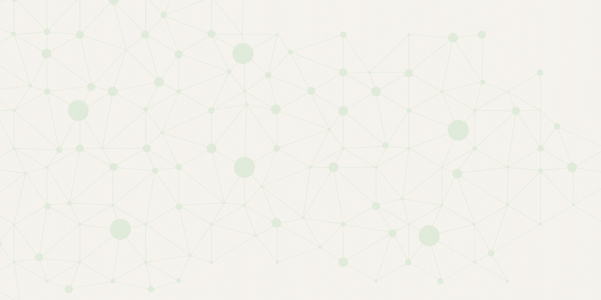

# Awesome LLM Red Teaming

   

A comprehensive list of tools and resources for red-teaming large language models (LLMs), vulnerability research, and reverse engineering using various techniques like prompt manipulation, adversarial testing, and model interpretation.

 

# LLM Red Teaming Resources by Technical Function

## Playgrounds and practice targets
- **[Folly](https://github.com/user1342/Folly)** - Open-source LLM prompt injection and jailbreak playground for hands-on experimentation.  
- **[DamnVulnerableMathLLM](https://github.com/user1342/DamnVulnerableMathLLM)** - Intentionally vulnerable maths LLM app for practising prompt injection and logic exploits.  
- **[DamnVulnerableShoppingLLM](https://github.com/user1342/DamnVulnerableShoppingLLM)** - Intentionally vulnerable shopping assistant scenario for testing data leakage and unsafe tool use.  
- **[RedTeam Arena](https://redarena.ai/)** - Competitive jailbreak challenges that train you to bypass model guardrails under time pressure.  
- **[MyLLM Bank](https://myllmbank.com/)** - WithSecure CTF where you exploit a multi-LLM banking app to learn real-world prompt injection chains.  
- **[MyLLM Doctor](https://myllmdoc.com/)** - WithSecure medical chatbot challenge showing multi-stage prompt injection and policy evasion.  
- **[Gandalf by Lakera](https://gandalf.lakera.ai/intro)** - Public challenge where you try to extract a secret from an aligned model despite protections.  

## Red teaming frameworks and agent harnesses
- **[PyRIT](https://github.com/Azure/PyRIT)** - Microsoft framework for systematic, repeatable red teaming of generative AI systems with automation support.  
- **[Rigging](https://github.com/dreadnode/rigging)** - Lightweight agent and tool-calling harness for orchestrating offensive LLM experiments in controlled environments.  

## Attack generation and jailbreak toolkits
- **[BrokenHill](https://github.com/BishopFox/BrokenHill)** - Implementation of the Greedy Coordinate Gradient attack that automatically crafts adversarial prompts.  
- **[llm-attacks](https://github.com/llm-attacks/llm-attacks)** - Research code for universal adversarial suffixes that transfer across aligned LLMs.  
- **[Spikee](https://labs.withsecure.com/tools/spikee)** - Simple prompt injection toolkit for probing and exploiting LLM applications.  

## Obfuscation and payload encoding utilities
- **[Invisible Unicode Tags Playground](https://josephthacker.com/invisible_prompt_injection)** - Converts text to invisible Unicode tags to smuggle hidden instructions past filters.  
- **[Emoji Variation Selector Playground](https://josephthacker.com/emoji_variation)** - Hides data in emoji variation selectors to evade naïve content checks.  
- **[ASCII to Unicode Character Reducer](https://josephthacker.com/unicode_reducer)** - Re-encodes ASCII as compact Unicode lookalikes to defeat brittle filters.  

## Traffic interception and support tooling
- **[☆ LLM-itM](https://github.com/user1342/LLM-itM)** - Man-in-the-middle proxy for OpenAI-compatible APIs that lets you inspect and modify prompts and responses.  

## Defences, standards and guardrails to test against
- **[Anthropic Constitutional Classifiers](https://www.anthropic.com/news/constitutional-classifiers)** - Rule-based alignment classifiers that red teamers can evaluate and attempt to bypass.  
- **[Prompt Guard 86M](https://huggingface.co/meta-llama/Prompt-Guard-86M)** - Small model for detecting unsafe prompts that can be assessed and circumvented.  
- **[OWASP Top 10 for LLMs](https://owasp.org/www-project-top-10-for-large-language-model-applications/)** - Community guidance on common LLM application risks and mitigations.  

## Research papers and technical articles
- **[Best-of-N Jailbreaks](https://arxiv.org/abs/2412.03556)** - Black-box strategy that samples many prompts and selects those most likely to bypass guardrails.  
- **[Universal and Transferable Attacks](https://arxiv.org/abs/2307.15043)** - Demonstrates universal adversarial suffixes that elicit unsafe outputs across models.  
- **[AutoDAN](https://arxiv.org/abs/2310.15140)** - Dual-LLM method that crafts gradient-inspired adversarial prompts to defeat filters.  
- **[Faster-GCG](https://arxiv.org/abs/2410.15362)** - Efficiency improvements that speed up discrete optimisation for jailbreak prompts.  
- **[GenBFA](https://arxiv.org/abs/2411.13757)** - Shows bit-flip weight corruption can induce malicious behaviour in generative models.  
- **[Manipulating LLM Recommendations](https://arxiv.org/abs/2404.07981)** - Examines how adversarial prompts can game LLM-driven recommenders.  
- **[GCG on OpenReview](https://openreview.net/forum?id=CMgxAaRqZh)** - Peer-review discussion of coordinate gradient jailbreak optimisation.  
- **[GCG explainer by Nightfall](https://www.nightfall.ai/ai-security-101/greedy-coordinate-gradient-gcg)** - Plain-language overview of GCG and why it works.  
- **[BrokenHill overview by Bishop Fox](https://bishopfox.com/blog/brokenhill-attack-tool-largelanguagemodels-llm)** - Practitioner write-up on applying GCG in the wild.  
- **[ACG by Haize Labs](https://blog.haizelabs.com/posts/acg/)** - Introduces an accelerated variant that dramatically reduces attack time.  

## Case studies and exploitation write-ups
- **[Microsoft on evolving guardrail attacks](https://www.microsoft.com/en-us/security/blog/2024/04/11/how-microsoft-discovers-and-mitigates-evolving-attacks-against-ai-guardrails/)** - Details jailbreak patterns observed in the wild and defensive responses.  
- **[Lessons from red teaming 100 AI products](https://www.microsoft.com/en-us/security/blog/2025/01/13/3-takeaways-from-red-teaming-100-generative-ai-products/)** - Summarises lessons from large-scale AI product red teaming.  
- **[Multi-chain prompt injection attacks](https://labs.withsecure.com/publications/multi-chain-prompt-injection-attacks)** - Explains chaining attacks across stages in complex LLM systems.  
- **[Context pollution and delayed tool use](https://embracethered.com/blog/posts/2024/llm-context-pollution-and-delayed-automated-tool-invocation/)** - Shows how polluting context can trigger dangerous automated tool use later.  
- **[Terminal ANSI sequence abuse](https://embracethered.com/blog/posts/2024/terminal-dillmas-prompt-injection-ansi-sequences/)** - Demonstrates how hidden escape codes in outputs can lead to local code execution.  
- **[Air Canada chatbot case](https://www.wired.com/story/air-canada-chatbot-refund-policy/)** - Real-world legal impact when an AI system produces binding misinformation.  

## Bug bounties and programmes
- **[Microsoft AI Bounty](https://www.microsoft.com/en-us/msrc/bounty)** - Official programme that accepts AI vulnerability reports with rewards.  
- **[0DIN AI](https://0din.ai/)** - Platform focused on GenAI bug bounties and evaluations.  

# Contributing

Your contributions are always welcome! Please read the contribution guidelines first. We follow the Contributor Covenant Code of Conduct. Please make sure to review and adhere to this code of conduct when contributing.

# License 

This project is licensed under the MIT License - see the LICENSE.md file for details.
